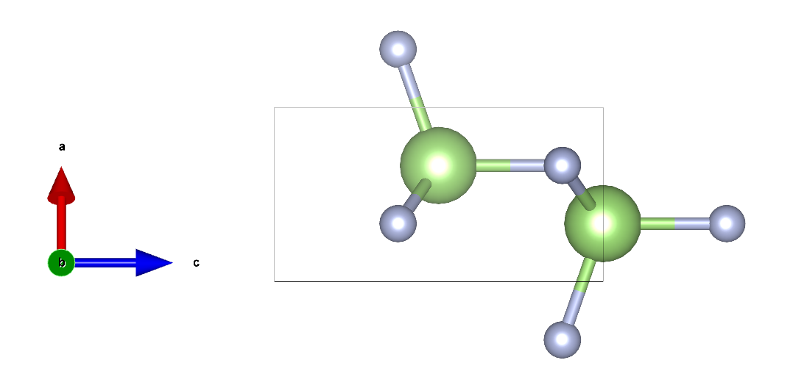
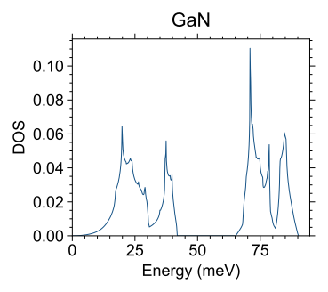
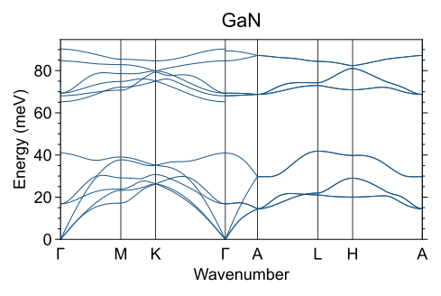
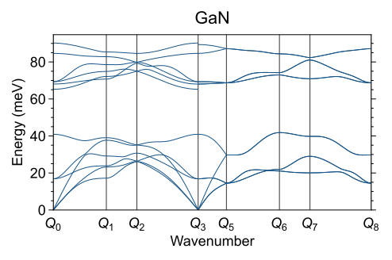
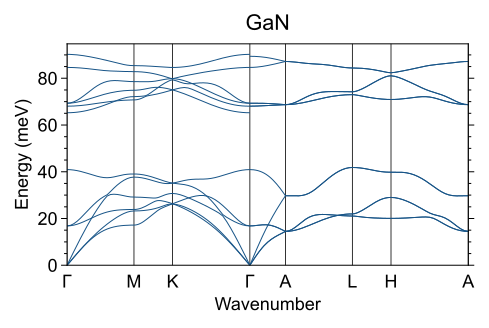
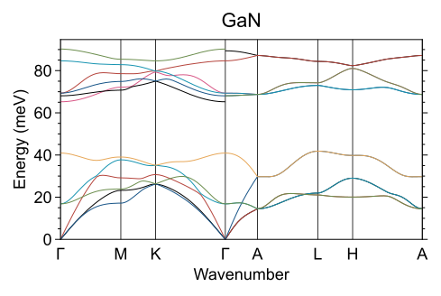
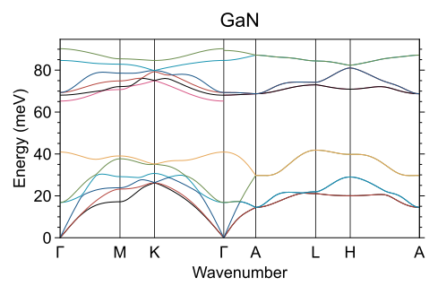
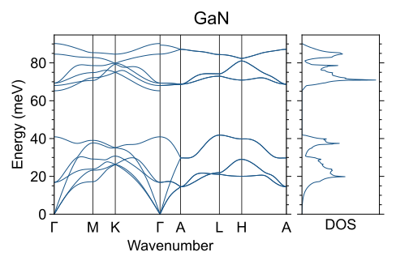
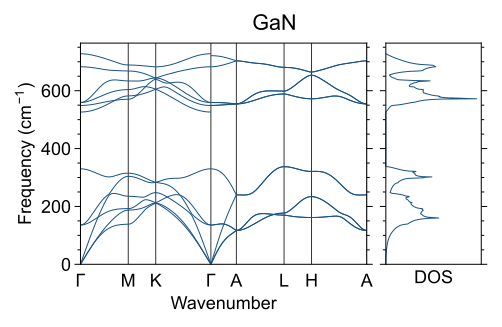
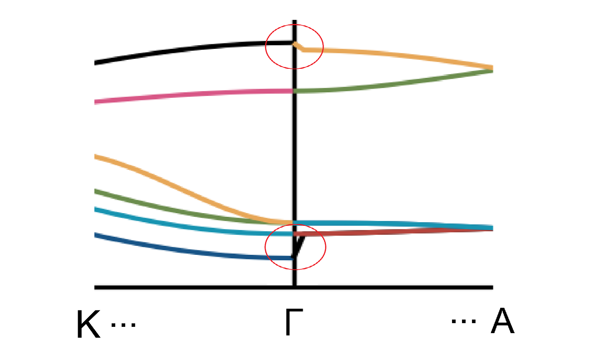

# ckqetools
Quantum ESPRESSO (QE)の結果を解析するためのツール。


## Installation

Python (3.11で動作確認)

インストール：

```
$ pip install git+https://github.com/mchizaki/ckqetools.git
```

次のライブラリが自動でインストールされる：

- numpy
- matplotlib
- pyyaml
- qe-tools
- Flask
- tools-barebone

また，[ckplotlib](https://github.com/mchizaki/ckplotlib)が必要になる：

```
$ pip install git+https://github.com/mchizaki/ckplotlib.git
```


アンインストール：

```
$ pip uninstall ckqetools
```


## Tutorial

### サンプルファイル

次図のGaNのユニットセル（格子定数 $a = 0.318893040\ \mathrm{nm}$, $c = 0.519235725\ \mathrm{nm}$）を例に説明を行う。




QEの結果のサンプルファイルを `tests/sample/GaN/` 内に格納した。次のようなディレクトリ構造になっている。

```
📂tests/sample/GaN/
├── 📄scf.in    # pw.x input file
├── 📄scf.out   # pw.x output file
├── 📄ph.in     # ph.x input file
├── 📄ph.out    # ph.x output file
├── 📄q2r.in    # q2r.x input file
├── 📄q2r.out   # q2r.x output file
├── 📄GaN.fc    # q2r.x output file (flfrc)
├── 📂dos                 # DOS
│   ├── 📄matdyn.dos.in   # matdyn.x input file
│   └── 📄matdyn.dos      # matdyn.x output file
├── 📂freq                # dispersion
│   ├── 📄matdyn.freq.in  # matdyn.x input file
│   └── 📄matdyn.modes    # matdyn.x output file
├── 📂freq100             # dispersion (interval=100)
│   ├── 📄matdyn.freq.in  # matdyn.x input file
│   └── 📄matdyn.modes    # matdyn.x output file
└── 📂freq_qpointsspecs   # dispersion (high-symmetry-point names are not used)
    ├── 📄matdyn.freq.in  # matdyn.x input file
    └── 📄matdyn.modes    # matdyn.x output file
```


### フォノンのDOS

`ckqetools-phonon-dos`

```
$ ckqetools-phonon-dos -h

usage: ckqetools-phonon-dos [-h] --dos-path DOS_PATH [--kayser] [--savedir SAVEDIR]
                            [--savefname-extra SAVEFNAME_EXTRA] [--title TITLE] [--vmin VMIN] [--vmax VMAX]

plot DOS from matdyn.dos file.

options:
  -h, --help            show this help message and exit
  --dos-path DOS_PATH   matdyn.dos file path
  --kayser              if True: phonon energy unit is kayser (cm^-1)
  --savedir SAVEDIR     directory name of saved figure [default: result]
  --savefname-extra SAVEFNAME_EXTRA
                        extra file name of saved figure
  --title TITLE         title of figure [default: None]
  --vmin VMIN           min val of figure [default: 0]
  --vmax VMAX           max val of figure [default: None]
```


📂tests/ へ移動


#### sample

```bash
$ ckqetools-phonon-dos \
    --dos-path               sample/GaN/dos/matdyn.dos \
    --savefname-extra        __GaN \
    --title                  GaN \
    --savedir                result/GaN
```




### フォノン分散

`ckqetools-phonon-dispersion`

```
$ ckqetools-phonon-dispersion -h

usage: ckqetools-phonon-dispersion [-h] --scf-input-path SCF_INPUT_PATH --scf-output-path SCF_OUTPUT_PATH
                                   --flvec-path FLVEC_PATH [--name NAME] [--phonon-json-path PHONON_JSON_PATH]
                                   [--disable-reorder] --matdyn-freq-input-path MATDYN_FREQ_INPUT_PATH
                                   [--high-symmetry-point-labels [HIGH_SYMMETRY_POINT_LABELS ...]] [--kayser]
                                   [--savedir SAVEDIR] [--savefname-extra SAVEFNAME_EXTRA] [--title TITLE]
                                   [--vmin VMIN] [--vmax VMAX] [--colorful]

plot dispersion from "matdyn.modes" file. input and output file of scf calculation are also required.

options:
  -h, --help            show this help message and exit
  --scf-input-path SCF_INPUT_PATH
                        path of input file of scf calculation
  --scf-output-path SCF_OUTPUT_PATH
                        path of output file of scf calculation
  --flvec-path FLVEC_PATH
                        path of flvec file (output of matdyn.x) [QE default: "matdyn.modes"]
  --name NAME           name [default: test]
  --phonon-json-path PHONON_JSON_PATH
                        path of output json file [default: None]
  --disable-reorder     if this option is "not" used: reorder eigenvalues at q by comparing the eigenvectors
                        and solve the band-crossings by phononweb
  --matdyn-freq-input-path MATDYN_FREQ_INPUT_PATH
                        path of input file to make dispersion by matdyn.x
  --high-symmetry-point-labels [HIGH_SYMMETRY_POINT_LABELS ...]
                        list of high-symmetry point labels [default: None]
  --kayser              if True: phonon energy unit is kayser (cm^-1)
  --savedir SAVEDIR     directory name of saved figure [default: result]
  --savefname-extra SAVEFNAME_EXTRA
                        extra file name of saved figure
  --title TITLE         title of figure [default: None]
  --vmin VMIN           min val of figure [default: 0]
  --vmax VMAX           max val of figure [default: None]
  --colorful            flag: dispersion lines are colorful
```


📂tests/ へ移動


#### sample1(通常ver)

```
$ ckqetools-phonon-dispersion \
    --scf-input-path         sample/GaN/scf.in \
    --scf-output-path        sample/GaN/scf.out \
    --flvec-path             sample/GaN/freq/matdyn.modes \
    --matdyn-freq-input-path sample/GaN/freq/matdyn.freq.in \
    --savefname-extra        __GaN \
    --title                  GaN \
    --savedir                result/GaN
```




#### sample2(100点刻みver)


#### sample3(q座標ver)

SCF計算で `ibrav` が0の場合には，`matdyn.x` 計算時の波数の経路をgG, Mなどの記号ではなく次のように座標で指定する必要がある。（対応するサンプルファイル：`sample/GaN/freq_qpointsspecs` ）

```fortran
9
0.00000000 0.00000000 0.00000000 20 ! Gamma
0.49999994 0.28867510 0.00000000 20 ! M
0.33333329 0.57735020 0.00000000 20 ! K
0.00000000 0.00000000 0.00000000 2  ! Gamma
0.00000000 0.00000000 0.00000000 20 ! Gamma
0.00000000 0.00000000 0.30707922 20 ! A
0.49999994 0.28867510 0.30707922 20 ! L
0.33333329 0.57735020 0.30707922 20 ! H
0.00000000 0.00000000 0.30707922 1  ! A
```

このままでは，分散の横軸のラベルが不明となる。次のように，`--high-symmetry-point-labels` オプションを使えば，任意の分散の横軸ラベルを指定可能である。

```
$ ckqetools-phonon-dispersion \
    --scf-input-path         sample/GaN/scf.in \
    --scf-output-path        sample/GaN/scf.out \
    --flvec-path             sample/GaN/freq_qpointsspecs/matdyn.modes \
    --matdyn-freq-input-path sample/GaN/freq_qpointsspecs/matdyn.freq.in \
    --savefname-extra        __GaN_qpointsspecs_w_highsym_labels \
    --title                  GaN \
    --savedir                result/GaN \
    --high-symmetry-point-labels gG M K gG gG A L H A
```


| `--high-symmetry-point-labels` なし                          | `--high-symmetry-point-labels` あり                          |
| ------------------------------------------------------------ | ------------------------------------------------------------ |
|  |  |


#### sample4(colorful ver)

```
$ ckqetools-phonon-dispersion \
    --scf-input-path         sample/GaN/scf.in \
    --scf-output-path        sample/GaN/scf.out \
    --flvec-path             sample/GaN/freq/matdyn.modes \
    --matdyn-freq-input-path sample/GaN/freq/matdyn.freq.in \
    --savefname-extra        __GaN_colorful \
    --title                  GaN \
    --savedir                result/GaN \
    --colorful
```




#### sample5(disable-reorder)

`--disable-reorder` オプションを付けると固有値の並び替えをせず，単に固有値の値の順に線を繋げただけになる。並び替えするときは，ある $q$ と隣の $q$ のそれぞれの固有ベクトルを比較して，適切なつなぎ方をする。（phononwebのサブルーチンを利用）。

```
$ ckqetools-phonon-dispersion \
    --scf-input-path         sample/GaN/scf.in \
    --scf-output-path        sample/GaN/scf.out \
    --flvec-path             sample/GaN/freq/matdyn.modes \
    --matdyn-freq-input-path sample/GaN/freq/matdyn.freq.in \
    --savefname-extra        __GaN_reorder \
    --title                  GaN \
    --savedir                result/GaN \
    --colorful --disable-reorder
```




### フォノン分散とDOSの両方

`ckqetools-phonon-dos-dispersion`

`ckqetools-phonon-dos` と `ckqetools-phonon-dispersion` の両方のオプションが使用できる。


📂tests/ へ移動


#### sample1(通常ver)

```bash
$ ckqetools-phonon-dos-dispersion \
    --scf-input-path         sample/GaN/scf.in \
    --scf-output-path        sample/GaN/scf.out \
    --flvec-path             sample/GaN/freq/matdyn.modes \
    --matdyn-freq-input-path sample/GaN/freq/matdyn.freq.in \
    --dos-path               sample/GaN/dos/matdyn.dos \
    --savefname-extra        __GaN \
    --title                  GaN \
    --savedir                result/GaN
```




#### sample2(kayser)

フォノン周波数を cm$^{-1}$ の単位で表示するには `--kayser` オプションを付ける。

```bash
$ ckqetools-phonon-dos-dispersion \
    --scf-input-path         sample/GaN/scf.in \
    --scf-output-path        sample/GaN/scf.out \
    --flvec-path             sample/GaN/freq/matdyn.modes \
    --matdyn-freq-input-path sample/GaN/freq/matdyn.freq.in \
    --dos-path               sample/GaN/dos/matdyn.dos \
    --savefname-extra        __GaN_kayser \
    --title                  GaN \
    --savedir                result/GaN \
    --kayser
```




## 実行スクリプト一覧

### ckqetools-phonon-dos

```
$ ckqetools-phonon-dos -h

usage: ckqetools-phonon-dos [-h] --dos-path DOS_PATH [--kayser] [--savedir SAVEDIR]
                            [--savefname-extra SAVEFNAME_EXTRA] [--title TITLE] [--vmin VMIN] [--vmax VMAX]

plot DOS from matdyn.dos file.

options:
  -h, --help            show this help message and exit
  --dos-path DOS_PATH   matdyn.dos file path
  --kayser              if True: phonon energy unit is kayser (cm^-1)
  --savedir SAVEDIR     directory name of saved figure [default: result]
  --savefname-extra SAVEFNAME_EXTRA
                        extra file name of saved figure
  --title TITLE         title of figure [default: None]
  --vmin VMIN           min val of figure [default: 0]
  --vmax VMAX           max val of figure [default: None]
```


### ckqetools-phonon-dispersion

```
$ ckqetools-phonon-dispersion -h

usage: ckqetools-phonon-dispersion [-h] --scf-input-path SCF_INPUT_PATH --scf-output-path SCF_OUTPUT_PATH
                                   --flvec-path FLVEC_PATH [--name NAME] [--phonon-json-path PHONON_JSON_PATH]
                                   [--disable-reorder] --matdyn-freq-input-path MATDYN_FREQ_INPUT_PATH
                                   [--high-symmetry-point-labels [HIGH_SYMMETRY_POINT_LABELS ...]] [--kayser]
                                   [--savedir SAVEDIR] [--savefname-extra SAVEFNAME_EXTRA] [--title TITLE]
                                   [--vmin VMIN] [--vmax VMAX] [--colorful]

plot dispersion from "matdyn.modes" file. input and output file of scf calculation are also required.

options:
  -h, --help            show this help message and exit
  --scf-input-path SCF_INPUT_PATH
                        path of input file of scf calculation
  --scf-output-path SCF_OUTPUT_PATH
                        path of output file of scf calculation
  --flvec-path FLVEC_PATH
                        path of flvec file (output of matdyn.x) [QE default: "matdyn.modes"]
  --name NAME           name [default: test]
  --phonon-json-path PHONON_JSON_PATH
                        path of output json file [default: None]
  --disable-reorder     if this option is "not" used: reorder eigenvalues at q by comparing the eigenvectors
                        and solve the band-crossings by phononweb
  --matdyn-freq-input-path MATDYN_FREQ_INPUT_PATH
                        path of input file to make dispersion by matdyn.x
  --high-symmetry-point-labels [HIGH_SYMMETRY_POINT_LABELS ...]
                        list of high-symmetry point labels [default: None]
  --kayser              if True: phonon energy unit is kayser (cm^-1)
  --savedir SAVEDIR     directory name of saved figure [default: result]
  --savefname-extra SAVEFNAME_EXTRA
                        extra file name of saved figure
  --title TITLE         title of figure [default: None]
  --vmin VMIN           min val of figure [default: 0]
  --vmax VMAX           max val of figure [default: None]
  --colorful            flag: dispersion lines are colorful
```


### ckqetools-phonon-dos-dispersion

```
$ ckqetools-phonon-dos-dispersion -h

usage: ckqetools-phonon-dos-dispersion [-h] --dos-path DOS_PATH --scf-input-path SCF_INPUT_PATH
                                       --scf-output-path SCF_OUTPUT_PATH --flvec-path FLVEC_PATH [--name NAME]
                                       [--phonon-json-path PHONON_JSON_PATH] [--disable-reorder]
                                       --matdyn-freq-input-path MATDYN_FREQ_INPUT_PATH
                                       [--high-symmetry-point-labels [HIGH_SYMMETRY_POINT_LABELS ...]]
                                       [--kayser] [--savedir SAVEDIR] [--savefname-extra SAVEFNAME_EXTRA]
                                       [--title TITLE] [--vmin VMIN] [--vmax VMAX] [--colorful]

plot DOS and dispersion from "matdyn.dos" and "matdyn.modes" files. input and output file of scf calculation
are also required.

options:
  -h, --help            show this help message and exit
  --dos-path DOS_PATH   matdyn.dos file path
  --scf-input-path SCF_INPUT_PATH
                        path of input file of scf calculation
  --scf-output-path SCF_OUTPUT_PATH
                        path of output file of scf calculation
  --flvec-path FLVEC_PATH
                        path of flvec file (output of matdyn.x) [QE default: "matdyn.modes"]
  --name NAME           name [default: test]
  --phonon-json-path PHONON_JSON_PATH
                        path of output json file [default: None]
  --disable-reorder     if this option is "not" used: reorder eigenvalues at q by comparing the eigenvectors
                        and solve the band-crossings by phononweb
  --matdyn-freq-input-path MATDYN_FREQ_INPUT_PATH
                        path of input file to make dispersion by matdyn.x
  --high-symmetry-point-labels [HIGH_SYMMETRY_POINT_LABELS ...]
                        list of high-symmetry point labels [default: None]
  --kayser              if True: phonon energy unit is kayser (cm^-1)
  --savedir SAVEDIR     directory name of saved figure [default: result]
  --savefname-extra SAVEFNAME_EXTRA
                        extra file name of saved figure
  --title TITLE         title of figure [default: None]
  --vmin VMIN           min val of figure [default: 0]
  --vmax VMAX           max val of figure [default: None]
  --colorful            flag: dispersion lines are colorful
```


## 補足：QEの実行について

### 計算手順

1. `pw.x`, `ph.x`, `q2r.x` により力定数のデータを計算する。フォノンのDOSと状態密度の計算で，`q2r.x` により作成される力定数のデータ（入力ファイルの `flfrc` で指定）が必要になる。
2. DOS: `matdyn.x` で計算
3. 分散: `matdyn.x` で計算


### matdyn.x（分散）実行時の注意

#### 波数の指定方法

分散の図の横軸の波数の経路は，QEの `matdyn.x` 実行時の入力ファイルで指定する。例えば $\Gamma \to \mathrm{M} \to \mathrm{K} \to \Gamma \to \mathrm{A} \to \mathrm{L} \to \mathrm{H} \to \mathrm{A}$ の経路で描画するには，次のようにする。

1. `ibrav` が0以外

   ```fortran
   8
   gG   20
   M    20
   K    20
   gG   20
   A    20
   L    20
   H    20
   A    1
   ```

2. `ibrav` が0のとき：座標を直接指定する必要がある。例えば，GaNのユニットセルで，格子定数が $a = 0.318893040\ \mathrm{nm}$, $c = 0.519235725\ \mathrm{nm}$ の場合，

   ```fortran
   8
   0.00000000 0.00000000 0.00000000 20 ! Gamma
   0.49999994 0.28867510 0.00000000 20 ! M
   0.33333329 0.57735020 0.00000000 20 ! K
   0.00000000 0.00000000 0.00000000 20 ! Gamma
   0.00000000 0.00000000 0.30707922 20 ! A
   0.49999994 0.28867510 0.30707922 20 ! L
   0.33333329 0.57735020 0.30707922 20 ! H
   0.00000000 0.00000000 0.30707922 1  ! A
   ```


#### 経路の途中に $\Gamma$点がある場合

フォノンのエネルギーはどの方向から波数が0に近づくかによって値が異なることがあるため，$\Gamma$ 点でのフォノン分散は不連続になることがある。例えばGaNの場合で $\mathrm{K} \to \Gamma \to \mathrm{A}$ の分散を上記の入力ファイルの形式で計算し，グラフを作成すると次の図のようになる。この場合，$\Gamma$ 点上のデータは $\mathrm{K}$ 方向から波数0に近づいた極限の値がプロットされているため，$\mathrm{A}$ 点方向のデータから線をつなげると斜めになってしまう。



QEの `matdyn.x` 入力ファイルのマニュアル(https://www.quantum-espresso.org/Doc/INPUT_MATDYN.html)には次のように書かれている。

> If q = 0, the direction qhat (q=>0) for the non-analytic part is extracted from the sequence of q-points as follows:
>
> qhat = q(n) - q(n-1)   or   qhat = q(n) - q(n+1)
>
> depending on which one is available and nonzero. For low-symmetry crystals, specify twice q = 0 in the list if you want to have q = 0 results for two different directions


そこで，上記の問題を避けるためには，次のように途中に $\Gamma \to \Gamma$ という2点を追加すれば良い。

```fortran
9
gG   20
M    20
K    20
gG   2
gG   20
A    20
L    20
H    20
A    1
```

`ckqetools-phonon-dispersion`, `cktools-phonon-dos-dispersion` では，同じ点が2連続で続く場合（例えばgG, gG）に，その間の線を切ってプロットする。
